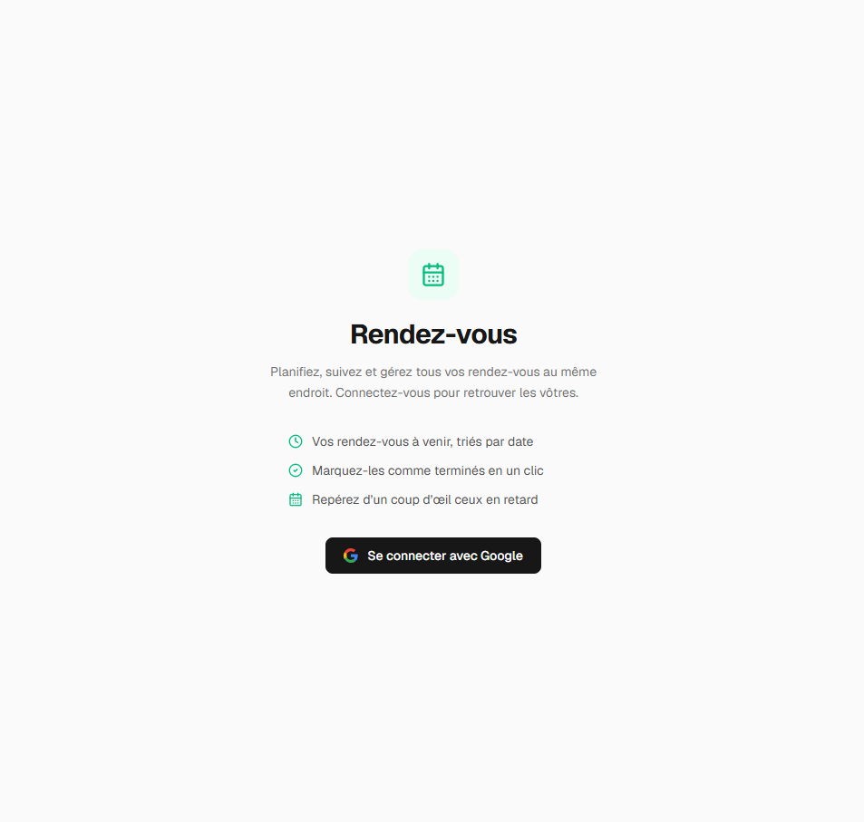
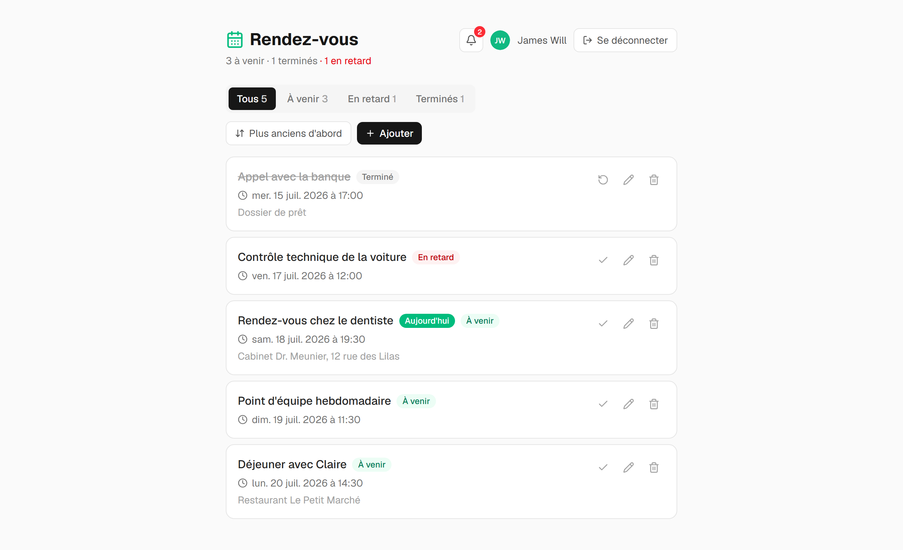
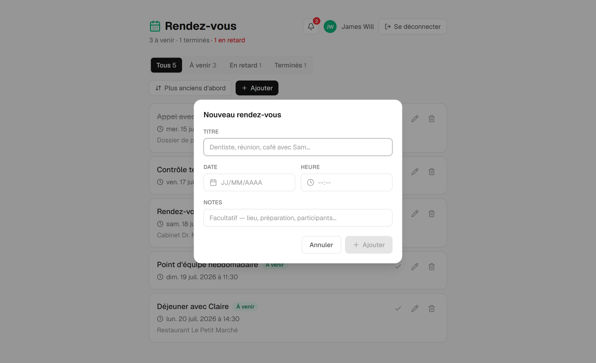
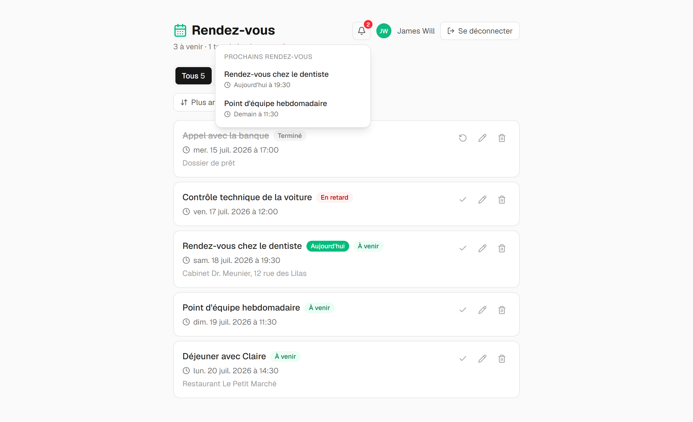

# Rendez-vous

**[appointment-manager-gilt.vercel.app](https://appointment-manager-gilt.vercel.app)**

A small appointment manager: sign in with Google, add your appointments, tick them off. The interface is in French; the code and docs are in English.

Built with the Next.js App Router, Prisma against Neon Postgres, and Auth.js for Google sign-in. Appointments are scoped to the signed-in user — you only ever see your own.

## Screenshots

Signed-out visitors land here. Google is the only way in.



Once signed in, appointments can be completed, edited, or deleted, and the tabs filter by status. Overdue and completed items are styled apart from what's still to come.



Adding one opens a dialog from the **Ajouter** button: a title, a date, a time, and optional notes.



The bell counts anything starting within the next 24 hours and lists it on click, labelled *Aujourd'hui* or *Demain*.



## What it does

- **Google sign-in.** Sessions are stored in the database; every query is scoped to the signed-in user.
- **Full CRUD** — create, edit, complete, delete. Updates are optimistic and revert if the server rejects them.
- **Status is derived, never stored.** An appointment is *à venir*, *terminé* (you ticked it), or *en retard* — past its time but never ticked. The overdue state is computed from the clock at read time, so an open tab rolls over on its own without a refresh.
- **Filter and sort** by status and start time.
- **French date and time pickers**, built from `react-day-picker` and a custom time picker, because native `<input type="date">` can't be locale-forced or themed.

## Stack

| | |
|---|---|
| Framework | Next.js 16 (App Router), React 19, TypeScript |
| Styling | Tailwind CSS 4 |
| Database | Neon (Postgres) via Prisma 7 |
| Auth | Auth.js v5 (`next-auth`) — Google provider |
| Tests | Vitest |

## Getting started

You'll need a [Neon](https://neon.tech) database and a Google OAuth client.

```bash
npm install
cp .env.example .env.local   # then fill it in
npx prisma migrate dev       # create the tables
npm run dev                  # http://localhost:3000
```

`DATABASE_URL` and `DIRECT_URL` go in `.env`; the auth variables go in `.env.local`. Both files are gitignored — `.env.example` explains every variable and where to get it.

For the Google client, create an OAuth 2.0 **Web application** credential in the [Google Cloud Console](https://console.cloud.google.com) and add this authorised redirect URI:

```
http://localhost:3000/api/auth/callback/google
```

While the OAuth consent screen is in *Testing* mode, only Google accounts listed as test users can sign in — everyone else gets `403: access_denied`.

## Scripts

```bash
npm run dev        # dev server
npm run build      # tests, then the production build — a failing test stops it
npm start          # serve the production build
npm test           # Vitest once
npm run lint       # ESLint
npm run db:studio  # browse the data
```

Running a **production build locally** needs `AUTH_TRUST_HOST=true` in `.env.local`, or sign-in fails with `UntrustedHost`. Auth.js infers it in dev and on Vercel, but not for `npm start`.

## Tests

```bash
npm test
```

Vitest, with everything under `test/`. Covered: the pure status/filter/sort logic, the shared hooks, and — most importantly — that **every server action rejects an unauthenticated caller and scopes its query to the session user**. Server actions are public HTTP endpoints, so that check is the boundary, not the UI.

A feature isn't done until it's tested. `npm run build` runs the tests first, and CI runs lint, typecheck, tests and build on every pull request.

## Project structure

```
app/          routes and pages (App Router), plus the Auth.js route handler
components/   UI, grouped by feature (appointments/, auth/, ui/)
hooks/        shared client hooks
lib/          prisma.ts, auth.ts, actions.ts — all database access lives here
test/         all tests
prisma/       schema and migrations
```

Components call server actions; they never touch Prisma directly.

## Deploying

`vercel.json` points Vercel at `npm run build:vercel`, which runs the tests, applies migrations, then builds — `next build` alone won't migrate, so without it the first deploy meets a database with no tables.

Set `DATABASE_URL`, `DIRECT_URL`, `AUTH_GOOGLE_ID`, `AUTH_GOOGLE_SECRET` and a fresh `AUTH_SECRET` in the Vercel project, and add `https://<your-domain>/api/auth/callback/google` to the Google client.
